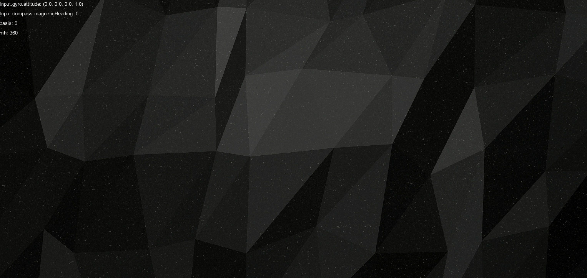

# Shadow Scent (Cubot)

- Author: Yuehao Wang, Yincen Xia, Yintao Xu，Peihao Wang

- :triangular_flag_on_post: An entry for 2018 Microsoft Imagine Cup (quarter-final)
- :trophy: *The First Place* of 2018 Spring-semester Design Thinking Roadshow at ShanghaiTech

---

## Game Design

### Sociability

The fact that we acquired from field research makes us focus on sociability of visually impaired people. In our field research, we talked over with several visually imparied massagers about their daily life and entertainment. Moreover, we did a survey among normal people to know about their attitudes towards communication with the visually impaired.
Those visually impaired people we interviewed told us smartphones are used very often in their life and they also like video games even they cannot enjoy fancy visual effects of games. On the other hand, normal people show high sympathy with visually impaired people according to our results of the survey. And a large group of them think they will try to touch visually impaired people and treat them like a normal friend if they have any chance.
Motivated by these ideas, we crystalized an idea to build a 2-player video game which can connect normal people and the visually impaired. The expected scenario is that one visually impaired people and one normal person stay together and share a game experience with each other, e.g. at a party. To give a stage to visually impaired people, we raise our idea of 'sense split', which means a simple task is split into two parts and each part is based on different sense. To accomplish a game task, two players are supposed to cooperate with each other.

### Innovation of Interaction

Games for visually impaired people used to be limited by audio sense, such as *audiobook*, a card game which provides information by audio announcements. Motion sensing game highly depends on visual sense and expensive equipment. These reasons make them unreachable for most visually impaired people. In addition to audio, our interaction bases on compass as well, which has been installed in many modern smartphones already, aiming to set up the sense of space for players. Any moves of the player will be synchronized to another player and make two players connect and interact anytime.

### Gameplay

Our demo shows a very simple task: Two players play the role of the different parts in a robot. One player controls the movement of the robot. One player controls the movement of the robot. At somewhere in the world of game, there is a mysterious invisible object which can only be heard by the second player. The second player rotates to control the probe at the head of the robot to determine the direction of the object, which simultaneously gives hint for the player who controls the robot to move.

### Demo Video

- Bilibili: https://www.bilibili.com/video/av78370080

### Screenshots





---

## Game Development

If you want to look deep into the game, instructions below may come to your help.

### Environment

- Game Engine: Unity
	- Test passed on Unity 2017.4.35f1
	- Platform: iOS & Android
- Plugins:
	- socket.io-unity: https://github.com/floatinghotpot/socket.io-unity

### Backend

As a 2P game, it is required to start a simple server in order to connect two players. The backend source code is located in the repository below.

https://github.com/philipxyc/ShadowScentBackend

To start up the backend, type the command:

```
npm start
```

> Our backend used to be established on Microsoft Azure but it is down right now. Therefore, you also needed to change the `serverUrl` attribute in `SocketIONetworking` class to your server URL (e.g. your local server IP).

### License

[GNU GPL](https://en.wikipedia.org/wiki/GNU_General_Public_License)